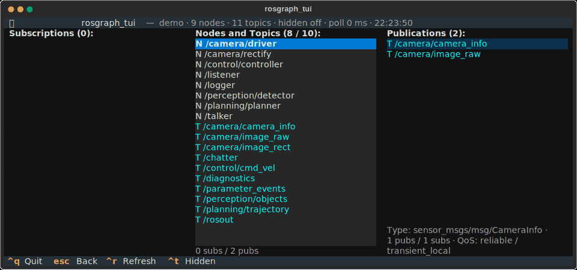

# rosgraph_tui

**Browse your ROS 2 graph like a file manager: type, arrow, done.**



`rqt_graph` is lovely for ten nodes. At three hundred nodes and two thousand
topics it turns into a hairball. *rosgraph_tui* replaces the hairball with a
list you can fuzzy-search and walk: pick a node, see what it reads and writes,
hop onto a topic, see who else is on it, and keep going. It runs in any
terminal, over SSH too, and it keeps up while your system starts, restarts and
falls over.

## Try it in 30 seconds (no ROS needed)

```zsh
python3 -m venv ~/.venvs/rosgraph_tui
~/.venvs/rosgraph_tui/bin/pip install 'git+https://github.com/orzechow/rosgraph_tui@ros2_port'
~/.venvs/rosgraph_tui/bin/rosgraph_tui --demo
```

Type `cam`, press `Enter`, press `→` twice. That is most of it.

## Use it with ROS 2

Tested on Humble and Jazzy (Python ≥ 3.10). rclpy comes from your ROS
installation, everything else from PyPI, so install into a venv that can see
the ROS Python packages:

```zsh
source /opt/ros/jazzy/setup.zsh       # or humble; setup.bash in bash
sudo apt install python3-venv python3-pip git
python3 -m venv --system-site-packages ~/.venvs/rosgraph_tui
~/.venvs/rosgraph_tui/bin/pip install 'git+https://github.com/orzechow/rosgraph_tui@ros2_port'
~/.venvs/rosgraph_tui/bin/rosgraph_tui
```

Not on PyPI yet, so the git URL it is (drop `@ros2_port` once this branch is
merged into `main`).

<details>
<summary>As a colcon package</summary>

```zsh
cd ~/ros2_ws/src && git clone -b ros2_port https://github.com/orzechow/rosgraph_tui
python3 -m venv --system-site-packages ~/.venvs/rosgraph_tui
~/.venvs/rosgraph_tui/bin/pip install textual rapidfuzz   # on Humble add: 'setuptools>=61'
source ~/.venvs/rosgraph_tui/bin/activate
cd ~/ros2_ws && colcon build --packages-select rosgraph_tui && source install/setup.zsh
ros2 run rosgraph_tui rosgraph_tui
```

The venv is needed because the Ubuntu packages of textual and rapidfuzz are
too old and there are no rosdep keys for recent versions. `pip install
--break-system-packages textual rapidfuzz` works too if you prefer.
</details>

## Keys

| Key | Does |
| --- | --- |
| type | fuzzy-filter the list; the best match is highlighted |
| `↑` `↓` | move; the highlighted entry's inputs and outputs are previewed left and right |
| `Enter` | root the view on the highlighted entry |
| `←` `→` | move between columns; press again at the outer edge to root on that entry |
| `Esc` | one step back: clear filter → un-root → show everything → quit |
| `Ctrl+T` | show or hide hidden names (`_ros2cli_daemon` and friends) |
| `Ctrl+R` | refresh now (it refreshes on its own every second) |
| `Ctrl+Q` | quit |

Useful flags: `--include-hidden`, `--refresh-rate HZ` (`0` = manual only),
`--demo`, `--fixture graph.json`, and anything after `--ros-args` goes to
rclpy. `--help` has the rest.

## Under the hood

- A tiny hidden rclpy node reads the discovery cache; nothing is spun, no daemon.
- One poll costs two calls per node, never per topic. QoS is fetched only for the
  topic you are looking at.
- Polls run in a worker thread and produce immutable snapshots; an unchanged
  graph means zero UI work. Polling backs off if it ever gets expensive.
- The list is virtualised and only the columns whose rows changed are rebuilt,
  so the highlight stays put while nodes come and go.

<details>
<summary>More</summary>

The rclpy source uses `get_node_names_and_namespaces`,
`get_topic_names_and_types` and per node
`get_publisher_names_and_types_by_node` / `get_subscriber_names_and_types_by_node`.
Between two full polls it first compares the node and topic lists and skips the
per-node phase when nothing changed (`--full-poll-every N`, default 5).
`get_publishers_info_by_topic` / `get_subscriptions_info_by_topic` give the QoS
of the highlighted topic. Discovery is asynchronous, so the list fills in
during the first second or two after start. On a synthetic 200-node,
600-topic graph a full poll takes about 15 ms; on 300 nodes / 2000 topics /
8000 edges the view derivation stays in the low milliseconds.
</details>

## Roadmap

- a release on PyPI (`pip install rosgraph-tui`) and rosdep keys
- services and actions next to nodes and topics
- `hz`, `bw` and `delay` for the topic under the cursor
- a prettier UI: theme, colours, layout
- better UX: help overlay, mouse support, copy names to the clipboard

## Development

```zsh
git clone -b ros2_port https://github.com/orzechow/rosgraph_tui && cd rosgraph_tui
uv sync && uv run pytest          # unit, Textual pilot and perf tests; no ROS needed
uv run rosgraph_tui --demo
```

Prefer pip? `python3 -m venv .venv && source .venv/bin/activate && pip install -e '.[dev]'`
(quotes matter in zsh). With a sourced ROS 2 environment `uv run pytest -m ros`
runs the rclpy integration test and `uv run python scripts/bench_poll.py` times
polls against a synthetic graph. `uv sync --group media && uv run python
scripts/make_media.py` regenerates the screenshot and GIF above. CI runs the
suite on Python 3.10 and 3.12 and inside a `ros:jazzy-ros-core` container.

## License

MIT
